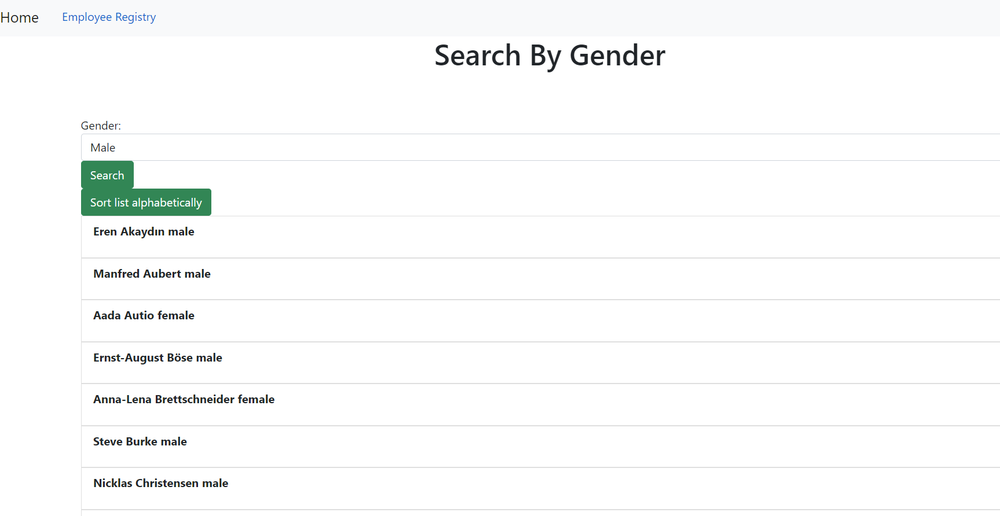

# Employee-Directory

Business Context

An employee or manager would benefit greatly from being able to view non-sensitive data about other employees. It would be particularly helpful to be able to filter employees by name.

Acceptance Criteria

Given a table of random users generated from the Random User API, when the user loads the page, a table of employees should render.
The user should be able to:

Sort the table by at least one category

Filter the users by at least one property.

Side note: Currently you can only filter and not sort and the CSS has not been finished.

GitHub:
https://github.com/EricMalpass/Employee-Directory

Deployed app:

Study Group:

-Sam Oberg

Tutur

-Quint Turner

